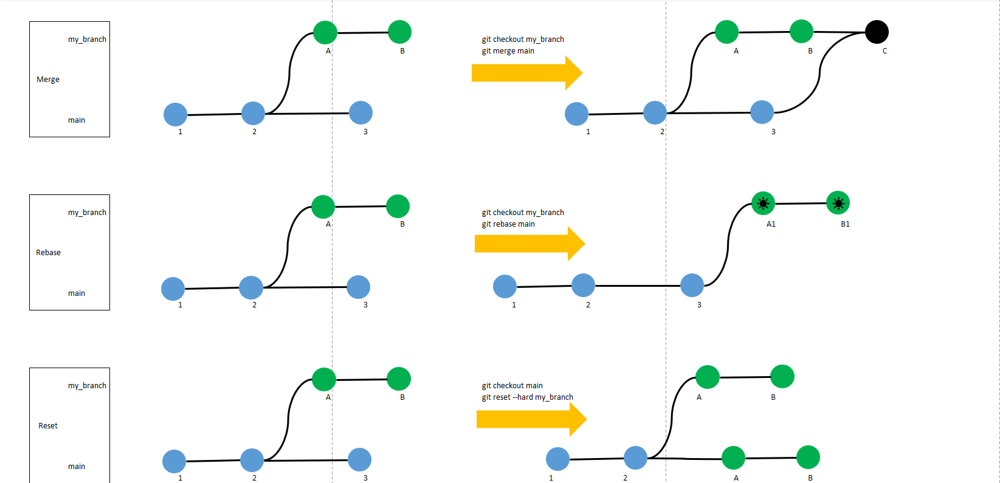
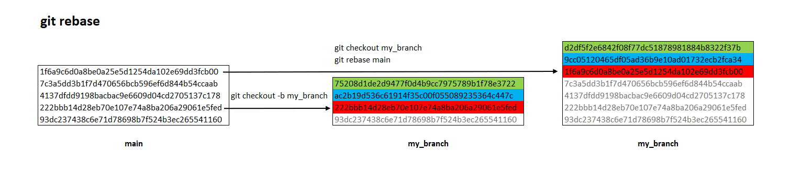

# `Git`常用命令

## 基本操作

1. 查看远程连接关系
    ```
    git remote -v
    ```
1. 切换已存在本地分支
    ```
    git checkout my_branch
    ```

1. 如果本地分支不存在，从当前分支创建新分支并切换到新分支

    ```
    git checkout -b my_branch
    ```

1. 同名分支, 从远程拉取更新到本地 (注意`git pull`只拉取当前分支, 所以注意先切换分支)
    ```
    git pull
    ```
1. 添加本地更改
    ```
    git add -A
    ```

1. 提交本地更改
    ```
    git commit -m 'comment'
    ```

1. 同名分支, 从本地推送更新到远程
    ```
    git push origin my_branch
    ```

## 高级操作

1. **远程覆盖本地(强制)**  

    用远程分支`origin/my_branch`重写本地`main`分支
    ```
    git checkout main
    git reset --hard origin/my_branch 
    ```

1. 本地覆盖远程(强制)
    ```
    git push origin main --force
    ```

## `git branch` 分支操作

1. 列出本地存在的分支，当前分支的前面用*标记
    ```
    git branch
    ```
1. 列出所有远程分支
    ```
    git branch -r
    ```

1. 列出所有分支，包括本地和远程
    ```
    git branch -a
    ```

1. 创建分支
    ```
    git branch my_branch
    ```

1. 从远程分支创建本地分支，并建立对应关系
    ```
    git branch my_branch origin/my_branch
    ```

1. 删除分支
    ```
    git branch -d my_branch 
    ```
    强制删除分支
    ```
    git branch -D my_branch  #强制删除分支
    ```

1. 删除远程分支
    ```
    git push origin --delete my_branch
    ```

1. 查看本地分支与远程分支的对应关系
    ```
    git branch -vv
    ```

1. 重命名分支
    ```
    git branch -m my_branch my_newBranch
    ```

### `git checkout`

1. **操作文件**  
    放弃单个文件的修改
    ```
    git checkout filename
    ```
    放弃当前目录下的修改
    ```
    git checkout .
    ```
1. **操作分支**  
    将分支切换到main
    ```
    git checkout main
    ```

1. 如果本地分支不存在，则先创建分支，再切换到新分支
    ```
    git checkout -b my_branch
    ```

## 合并分支`git merge` vs `git rebase`

1. 本地2个分支合并, 将`my_branch`合并到`main`

    ```
    git checkout main
    git merge my_branch
    ```
    > [!Tip]
    > 假如合并由冲突，需要手动解决冲突

1. 不同分支之间的同步, 用`rebase`命令将分支`my_branch`的基修改到`main`最新提交
    ```
    git checkout my_branch
    git rebase main
    ```

    > [!Tip]
    > rebase也可能遇到冲突， 对于每个冲突文件，需要手动合并
    ```
    git add -A
    git commit -m "resolve conflicts"
    ```
    然后，
    ```
    git rebase --continue
    ```

## 附件
git分支合并方式示意图
[](images/git-merge-rebase-reset.png)

git rebase示例
[](images/git-rebase.png)