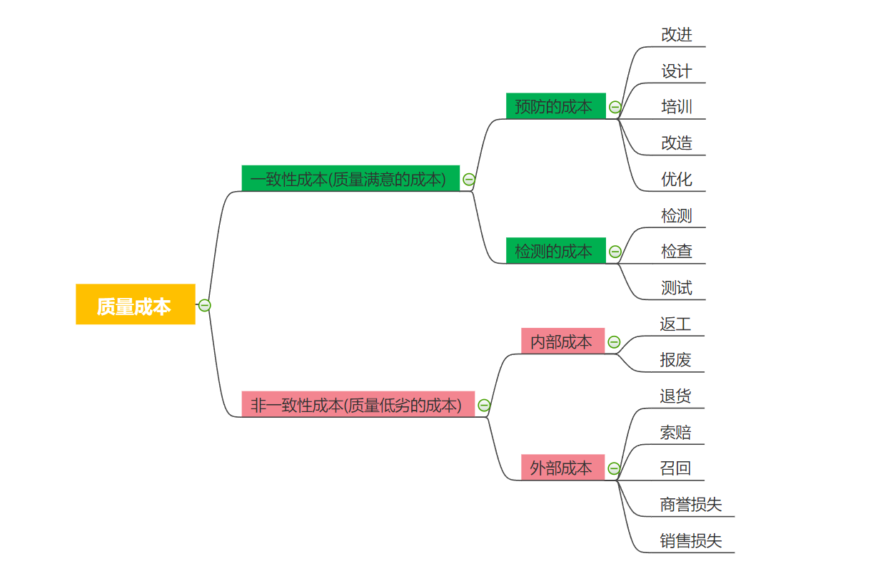
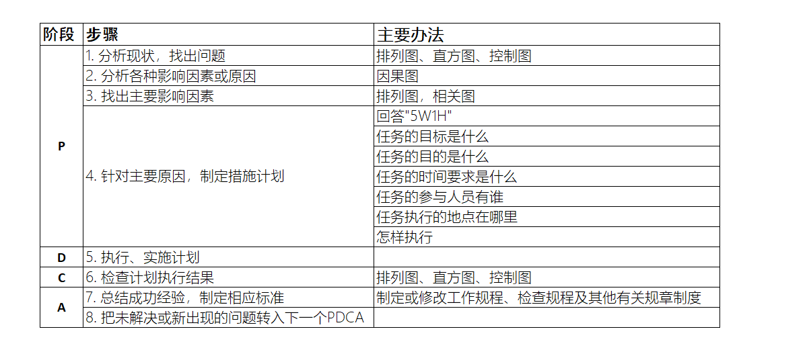

# 质量管理

质量管理的核心包括**管理质量**和**控制质量**。管理质量是指通过制定标准流程来提高产品或服务质量，控制质量是指在产品交付之前，通过开展内部检查，发现缺陷，纠正缺陷，提高交付产品的质量，提高客户满意度。

## 质量管理的核心概念

质量管理需要兼顾**过程**和**结果**两个方面，项目质量管理适用于所有的项目，无论项目的可交付成果（结果）具有何种特性。

> [!TIP]
> 质量的测量方法和技术则需针对项目所产生的可交付成果类型而定。

> 例如， 软件项目的可交付成果为程序和文档， 就需要使用不同类型的测试方法保证软件没有缺陷， 文档完整。 建筑项目的可交付成果是一栋建筑，就需要依据要求对建筑的各种特性进行测量来保证建筑的质量符合相应标准。

无论是什么项目， 若没有达到质量要求，都会给项目相关方带来严重的负面后果。例如：
- 为满足客户要求而让团队超负荷工作，就可能导致利润下降（需要发加班费）、整体项目风险增加（赶工往往带来质量低下），以及员工疲劳、出错或返工。
- 为满足项目进度目标而仓促完成预定的质量检查，就可能造成检验疏漏、利润下降，以及后续风险增加。

## 质量保证的方法

> [!IMPORTANT]
> 预防胜于检查。

最好将质量设计到可交付成果中，而不是在检查时发现质量问题。预防错误的成本通常远远低于在检查或使用中发现并纠正错误的成本。

1. 预防， 针对**过程的持续改进**，保证过程不出错。
2. 检查，针对的是**结果**， 通过对结果进行检查，保证错误不落入客户手中。

## 质量成本

由防止出现错误和产生错误所产生的一切费用都是质量成本。通俗来说，如果你提供某种产品给你的客户，*质量成本是指因为你没有第一次就做好而产生的所有有关成本*。

> [!TIP]
> 例如，因为质量缺陷而造成的返工，或因质量缺陷事件造成品牌声誉受损等。

质量成本通常包括三方面：预防成本、评估成本、和失败成本，而失败成本又分为内部的成本和外部的成本。

**一致性成本**  
一致性成本是对项目有益的，它是为了得到更好的质量而付出的成本。预防成本和评估成本就是一致性成本。

* 预防成本，改进生产，设计，培训，改造，优化
* 评估成本，检测，检查，测试

**非一致性成本**  
失败成本又称为非一致性成本，或质量低劣的成本。是指企业因为产品或服务的质量低劣而产生的一起损失。它包括内部失败成本和外部失败成本。

* 内部失败成本，返工，报废
* 外部失败成本，退货，索赔，召回， 商誉损失，销售损失

## 质量管理水平

质量管理水平分5个等级，等级越高代表你的企业的质量管理水平越高。

1. 让客户来发现缺陷.
2. 控制质量过程，包括先检测和纠正缺陷
3. 通过质量保证，检查和纠正过程本身
4. 将质量融入项目和产品的规划和设计
5. 在组织内创建一种关注并致力于实现过程和产品质量的文化。

## 质量改进的方法
质量改进的目标是追求零缺陷，通过根本原因分析来持续推进过程改进活动。 

在整个项目期间频繁开展质量与审核步骤，而不是在面临项目结束时才执行。 循环回顾，定期检查质量过程的有效性；寻找问题的根本原因，然后建议实施新的质量改进方法；后续回顾会议评估实验过程，确定新方法是否可行，是否应继续使用，是否应该调整，或者直接弃用。

最有名的持续改进模型是戴明提出的**PDCA**, 即*计划 (plan)，执行 (do)， 检查 (check)，措施 (action)*。

### PDCA步骤

1. P（Plan）--计划，通过集体讨论或个人思考**确定某一行动**或某一系列行动的方案，包括5W1H(What, Why, When, Who, Where, How):
    1. What(何事), 我们做的事情是什么？ (任务的目标是什么)
    1. Why(何因), 我们为什么要做这件事？(任务的目的是什么)
    1. When(何时), 这件事什么时间开始，什么时间完成？(任务的时间要求是什么)
    1. Who(何人), 这件事由谁负责，哪些人来完成？(任务的参与人员有谁？)
    1. Where(何地), 这件事在什么地点开展? (任务执行的地点在哪里？)
    1. How(何法), 我清楚如何做吗？怎样执行？采取哪些有效措施？
1. D（Do）--执行人执行，**按照计划去做**，落实计划。
1. C（Check）--检查或研究执行人的执行情况，比如到计划执行过程中的**控制点**(checkpoint)去收集信息，“计划执行的怎么样？有没有达到预期的效果或要求？”，**找出问题**。
1. A（Action）--效果，对检查的结果进行处理，**认可或否定**。成功的经验要加以肯定，或者模式化或者标准化以适当推广；失败的教训要加以总结，以免重现；这一轮未解决的问题放到下一个PDCA循环。
    * ACTION（开拍、开始）：在拍片现场，导演用来命令演员开始表演的口头用语。
    * ACTION的真正含义：为什么导演开拍的时候不用act,start,begin等动词，而用名词action呢？原因是因为在表演的时候，演员仅仅是在表达导演已经构思好的电影，导演在拍摄的时候会对比演员表演的action是否与自己的构思、感觉是否一致，如果一致的话就继续下一个镜头，如果感觉不对，**没有达到导演要的效果就会再来一遍了**。
    所以action真正的含义表示导演准备看演员表演的action（效果），这也是为什么会选这个名词动用。
    这也是为什么PDCA会选这个名词动用，PDCA循环同样是要看效果的！

**戴明循环的步骤和方法**

## 总结

质量管理的实现主要通过两方面实现：一是通过对流程进行优化来预防错误的产生；二是通过检查来消除缺陷产品落到客户手中。两种方法中，预防胜于检查。在企业或组织中， 管理层对质量负责，全体成员参与质量管理的过程。一旦出现质量问题， 质量成本将大大超出质量管理的成本，所以，企业应该增加投入进行质量管理并致力于创建一种关注过程和产品质量的文化。