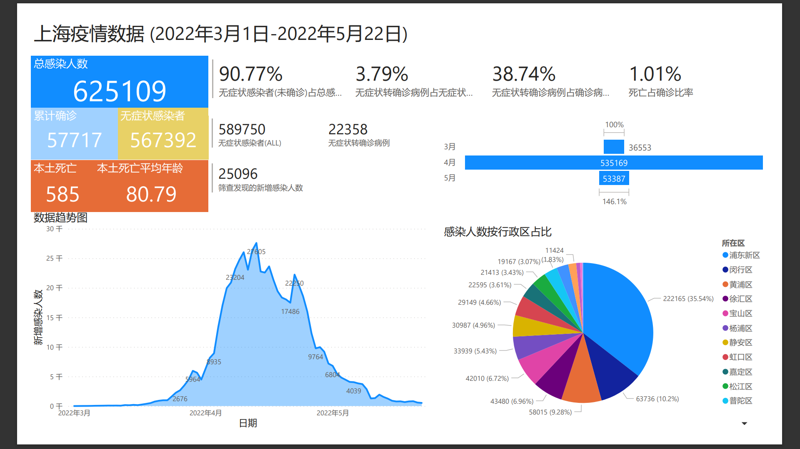
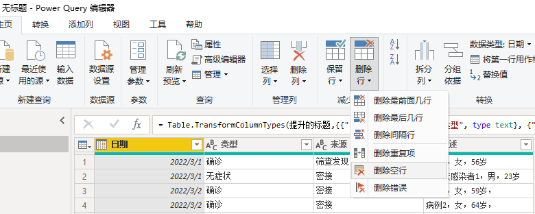
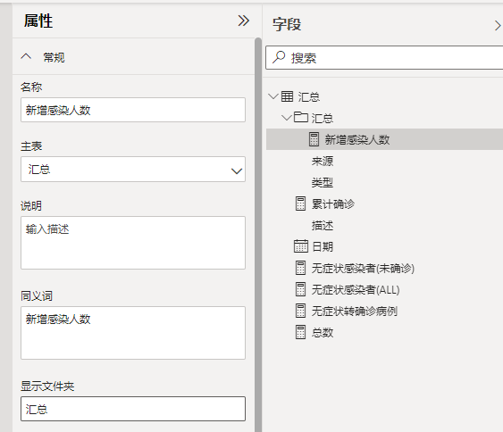
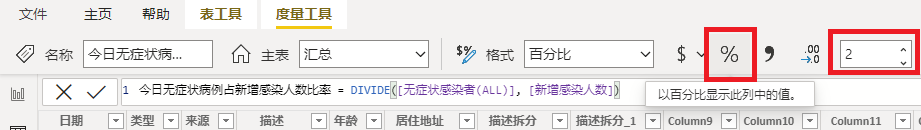

# Power BI创建度量值-汇总，占比

使用Power BI Desktop工具创建报表来对业务数据进行加工、处理、分析和呈现。我们使用上海疫情数据集为例，手把手创建一个多维度的报表。

## 报表结果：

[](images/2022-bi-result.png#lightbox)

## 数据准备

### 获取数据文件

1. 从以下位置下载Excel数据文件 [covid-19-case-sample.xlsx](images/covid-19-case-sample.xlsx).
2. Excel表格中的数据结构如下：

| 日期 | 类型 | 来源 | 描述 |
| --- | --- | --- | --- |
|  |  |  | |
|  |  |  | |

### 使用Power BI Desktop连接到Excel数据源

使用Power BI Desktop连接到Excel数据源。

1. Power BI Desktop
2. 获取数据
3. Excel
4. 转换数据
5. 在Power Query编辑器中， 选择**删除行**，依次选择**删除空行**，和**删除错误**。
   
6. 选择**关闭并应用**。

> 在**数据**选项卡，验证汇总表单中数据已经加载到Power BI Desktop汇总表。

## 创建度量值

### 汇总度量值 - 总数

1. 总数代表了汇总表单中数据的总和，也就是汇总表单中的总行数。
2. 选择**数据**选项卡， 点击**新建度量值**。
   
3. 在公式编辑框中，输入总数的DAX计算方法，我们使用CountRows.

```
总数 = COUNTROWS('汇总')
```

### 汇总度量值 - 累计确诊

1. 在总数中， **类型**是**确诊**的数据就是累计确诊的值。
2. 使用同样方法，**新建度量值**。
3. 在公式编辑框中，输入累计确诊的计算方法。

```
累计确诊 = CALCULATE([总数],'汇总'[类型] = "确诊")
```

### 汇总度量值 - 其他值

*依此类推， 我们依次创建其他度量值*。

无症状感染者(ALL)：

```
无症状感染者(ALL) = CALCULATE([总数],'汇总'[类型] = "无症状")
```

无症状转确诊病例：

```
无症状转确诊病例 = CALCULATE([总数],'汇总'[来源] = "无症状转换")
```

无症状感染者(未确诊)：

```
无症状感染者(未确诊) = [无症状感染者(ALL)] - [无症状转确诊病例]
```

新增感染人数：
新增感染人数就是总数去除无症状转确诊的人数。

```
新增感染人数 = [总数] - [无症状转确诊病例]
```

筛查发现的新增感染人数：

```
筛查发现的新增感染人数 = CALCULATE([总数],'汇总'[来源] = "筛查发现")
```

筛查发现的确诊病例：

```
筛查发现的确诊病例 = CALCULATE([筛查发现的新增感染人数],'汇总'[类型] = "确诊")
```

筛查发现的无症状感染者：

```
筛查发现的无症状感染者 = CALCULATE('汇总'[筛查发现的新增感染人数],'汇总'[来源] = "无症状")
```

## 创建文件夹管理汇总度量值

1. 选择**模型**选项卡， 展开**属性**窗口， 在**字段**窗口中，点击任意字段名称。
2. 在**属性**窗口中， 定位到**显示文件夹**， 输入文件夹名称，例如， 汇总。
3. 按Enter确认后，可以看到选中字段已经放入了汇总文件夹中。
   
4. 将其他汇总度量值依次拖入该文件夹。

### 占比度量值 - 今日无症状病例占新增感染人数比率

1. 计算比例，我们使用`DIVIDE`函数，并将分子/分母传入参数中。
2. 在**数据**选项卡， 点击**新建度量值**。
3. 在公式编辑框中，输入`今日无症状病例占新增感染人数比率`的计算方法。
4. 选择**以百分比显示此列中的值**。
   

```
今日无症状病例占新增感染人数比率 = DIVIDE([无症状感染者(ALL)], [新增感染人数])
```

### 占比度量值 - 其他值

*依此类推， 我们依次创建其他度量值*。

筛查发现占新增感染人数的比率：

```
筛查发现占新增感染人数的比率 = DIVIDE([筛查发现的新增感染人数], [新增感染人数])
```

无症状转确诊病例占无症状感染者比率：

```
无症状转确诊病例占无症状感染者比率 = DIVIDE([无症状转确诊病例], [无症状感染者(ALL)])
```

无症状转确诊病例占确诊病例比率：

```
无症状转确诊病例占确诊病例比率 = DIVIDE([无症状转确诊病例], [累计确诊])
```

无症状感染者（未确诊）占总感染人数比率：

```
无症状感染者（未确诊）占总感染人数比率 = DIVIDE([无症状感染者(未确诊)], [新增感染人数])
```

死亡占确诊比率：

```
死亡占确诊比率 = DIVIDE([死亡人数], [累计确诊])
```

### 创建文件夹管理占比度量值

*同样方法创建文件夹来组织占比度量值。*


## 总结

我们以疫情数据集为例，在Power BI Desktop中使用**新建度量值**来创建了分类汇总数据和占比数据， 其中用的了COUNTROWS, CALCULATE 和DIVID函数。在模型中，我使用**显示文件夹**功能将度量值按类别放到不同的文件夹中。

